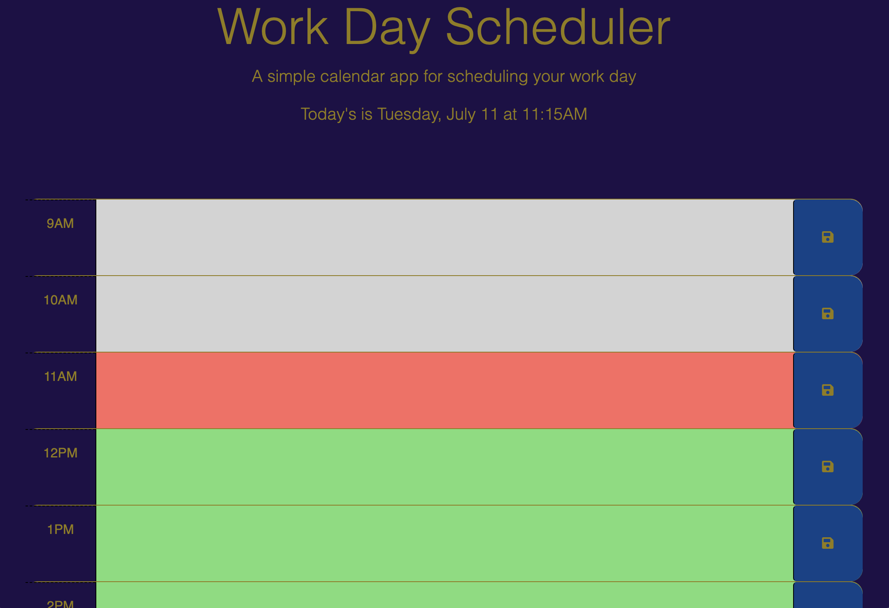
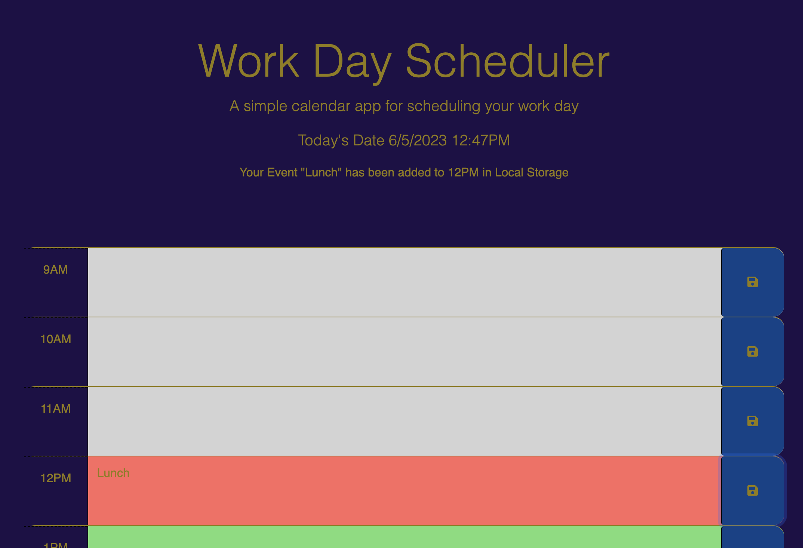

# Calendar
 
Within this repo I create a simple daily calendar web app. With the app you can add your events for the day. 
The added events are saved in 
[Local Storage](https://www.w3schools.com/html/html5_webstorage.asp)
so that the event can be displayed later.

To build the app I use 3 different linked API style sheets from [Bootstrap](https://cdn.jsdelivr.net/npm/bootstrap@5.1.3/dist/css/bootstrap.min.css), 
[Fontawesome](https://use.fontawesome.com/releases/v5.8.1/css/all.css),
and
[Google](https://fonts.googleapis.com/css2?family=Fira+Sans:wght@400;700&display=swap). 
The 
[jQuery](https://jquery.com/)
library is used to build some website and add much of the functionality. 

The Javascript library
[Day.js](https://day.js.org/docs/en/display/format)
is also used to get date and time information.  

The [index.html](./index.html) only contains a div for the hour of "9AM". I use JavaScript with the help of the 
[clone()](https://api.jquery.com/clone/)
method from `jQuery` to create the div's for the hours "10AM" through "5PM". 
The Javascript also adds a [comment](#javascript-comments) to each div that is created this way. 

To get the colors to change based upon the hour of the day. I use the 
[Date](https://developer.mozilla.org/en-US/docs/Web/JavaScript/Reference/Global_Objects/Date)
method to determine what time of day it is,
once the time has been established. 
The `jQuery` methods 
[removeClass()](https://api.jquery.com/removeclass/)
&
[addClass()](https://api.jquery.com/addclass/)
are used to remove or add the class attributes `past`, `present`, or `future` depending on the hour. 

 
## Javascript comments
In the following screenshot you can see the div's and comments that are created by the Javascript.
