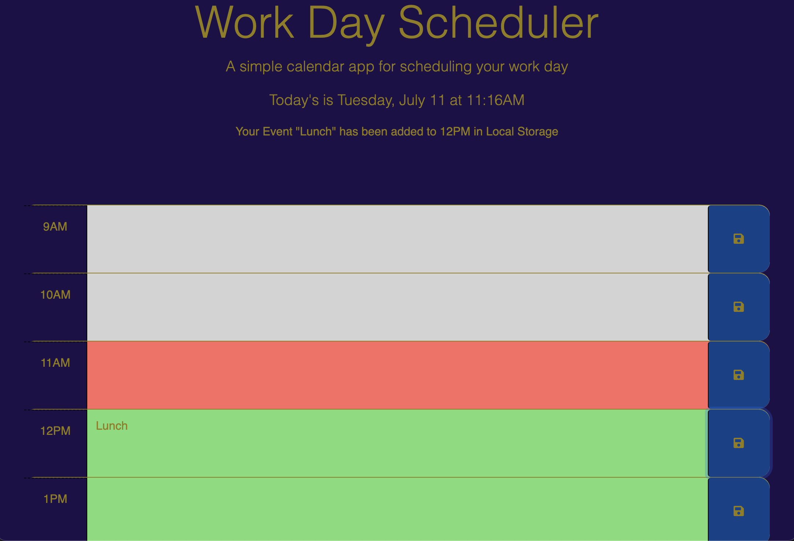
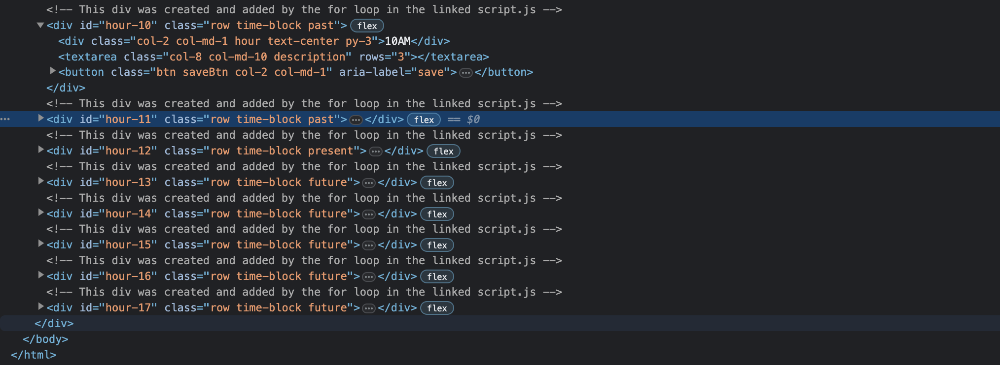

# Calendar
 
Within this repo I create a simple daily calendar web app. With the app you can add your events for the day. 
The added events are saved in 
[Local Storage](https://www.w3schools.com/html/html5_webstorage.asp)
so that the event can be displayed later.

To build the app I use 3 different linked API style sheets from [Bootstrap](https://cdn.jsdelivr.net/npm/bootstrap@5.1.3/dist/css/bootstrap.min.css), 
[Fontawesome](https://use.fontawesome.com/releases/v5.8.1/css/all.css),
and
[Google](https://fonts.googleapis.com/css2?family=Fira+Sans:wght@400;700&display=swap). 
I also use the 
[jQuery](https://jquery.com/)
library. 

The [index.html](./index.html) only contains a div for the hour of "9AM". I use JavaScript with the help of the 
[clone()](https://api.jquery.com/clone/)
method from
`jQuery`
the div for the hours "10AM" through "5PM" are created. 
[removeClass()]()
[addClass()]()

